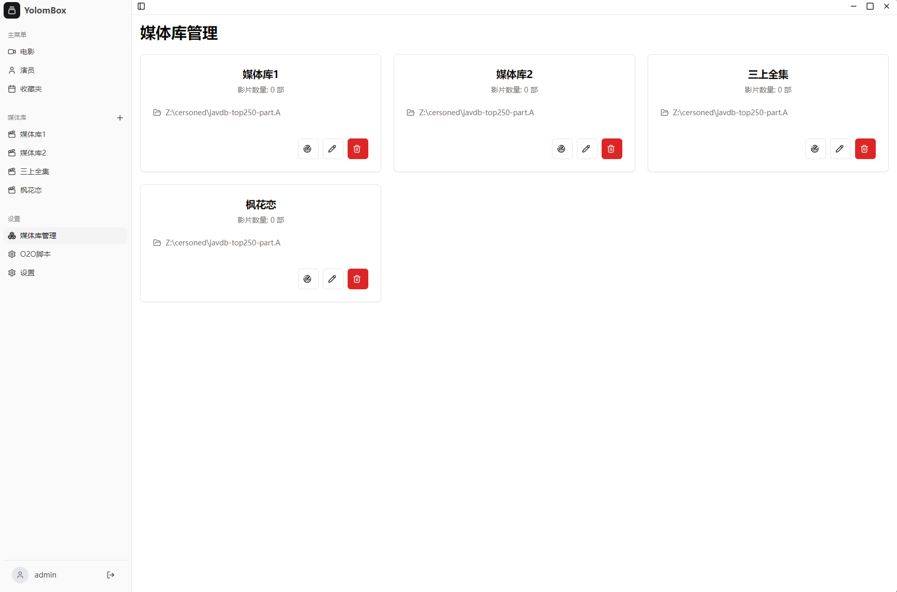
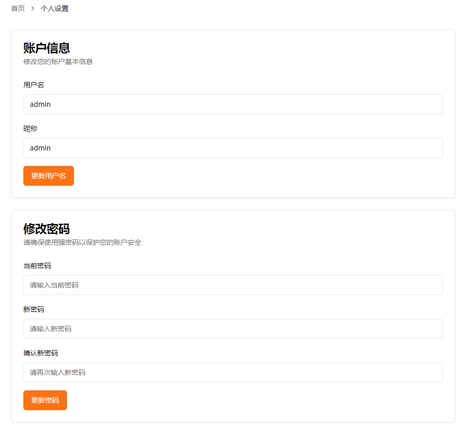
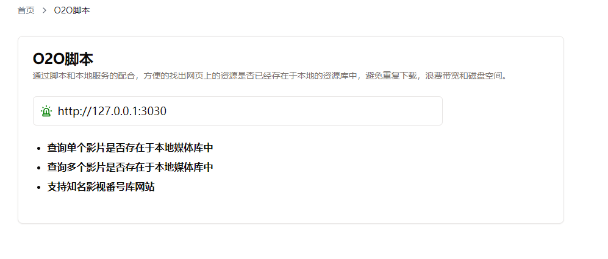
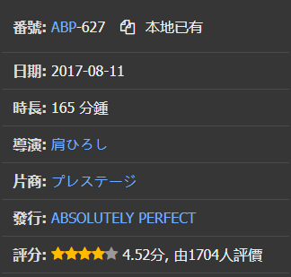

# YolomBox - Your local movie box.

开发本软件的出发点主要是为了解决很多人其实还不足以自建nas或者其他云存储的设施，相比较他可能更多是存储在本地获取某个指定的硬盘中。为了更方便管理本地影视片源，于是开发了此工具。

由于本工具不提供刮削功能。使用本工具前需要先使用其他工具将视频文件进行刮削和文件归类处理，这样便于工具扫描本地的nfo文件，并进行信息搜集和入库处理。

软件初始登录账户密码为:admin / admin888

本软件包含的功能主要围绕本地的影视文件管理（**主要是已经刮削过，本软件暂时不提供刮削功能**），并结合[Gfriends 女友头像仓库](https://github.com/xinxin8816/gfriends) 构建演员库。具体功能包含

### 基础功能
- [x] 登录
- [x] 退出

### 全局
- [x] dashboar页面
- [x] 左侧导航
- [ ] 系统设置(数据备份，系统信息查看，代理设置)
- [x] 个人设置
- [x] 提供脚本，便於比對綫上庫和本地文件是否已經有存儲，支持javdb和javbus
- [ ] 提供完整的日志流程。

### 媒体库
- [x] 所有媒体库
- [x] 新建媒体库
- [x] 删除媒体库
- [x] 媒体库列表
- [x] 媒体库详情
- [x] 媒体库编辑
- [x] 媒体库扫描

### 电影
- [x] 所有电影
- [ ] 删除电影
- [x] 电影列表
- [x] 电影详情
- [ ] 电影编辑
- [x] 收藏电影/取消收藏
- [x] 我的收藏
- [x] 搜索影片(支持番号、标题、演员等)
- [ ] 推荐影片

### 演员
- [x] 所有演员
- [ ] 编辑演员
- [x] 演员列表
- [ ] 演员合并

产品效果截图

* 软件主界面

* 所有演员

* 媒体库管理

* 影片详情

* 影片搜索

* 个人资料维护

* O2O脚本（可以查验相关影片正在浏览器的影片本地是否已有,目前支持javbus和javdb）

